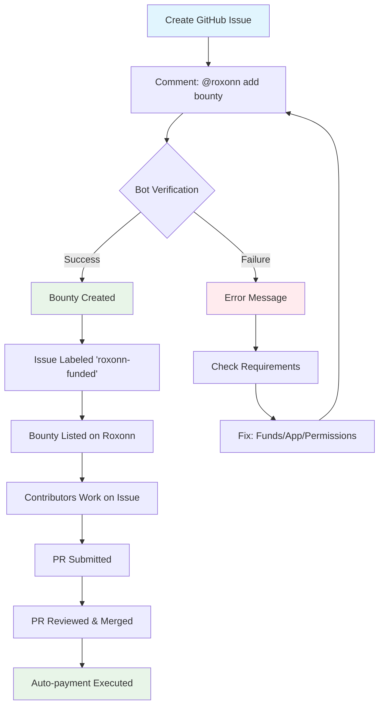

# Roxonn Platform: Pool Manager Manual

## Overview
Pool Managers are project maintainers who fund repositories to attract quality contributors. This manual explains how to use **Roxonn** as a **Pool Manager** to fund your open-source projects and manage contributor rewards.

---


*Main homepage showing repository overview and funding options*

---

## Table of Contents

<details>
<summary><strong>Click to expand</strong></summary>

- [Getting Started](#getting-started)
- [Repository Registration](#repository-registration)
- [Funding Your Repository](#funding-your-repository)
- [Managing Rewards](#managing-rewards)
- [Working with Contributors](#working-with-contributors)
- [Advanced Features](#advanced-features)
- [Troubleshooting](#troubleshooting)

</details>

---

## Getting Started

### Prerequisites
- A GitHub account  
- A repository you maintain (public or private)  
- XDC wallet with funds (**XDC**, **ROXN**, or **USDC**)  
- Basic understanding of pull requests and code review  

---

### Registration Process
1. **Visit the Platform**  
   Go to [app.roxonn.com](https://app.roxonn.com)
   
   
*Earn crypto by contributing to open source - Landing page*

2. **Connect GitHub**  
   Authorize Roxonn to access your GitHub account

   
*Complete your profile and connect GitHub account*

3. **Wallet Setup**  
   The system automatically generates an XDC wallet for you

4. **Complete Profile**  
   Add any additional information related to your project

---

### Dashboard Walkthrough

**Key Dashboard Sections:**
1. **Repository Overview** - Quick stats for all your projects
2. **Funding Status** - Current balances and funding needs
3. **Active Bounties** - Open bounties across all repositories
4. **Pending Reviews** - Contributions awaiting your approval
5. **Recent Payouts** - Transaction history

### Checking Pool Balances
1. Navigate to your repository dashboard
2. View the "Pool Balance" card showing:
   - Total allocated funds
   - Available balance
   - Reserved for active bounties
   - Recent transactions

### Managing Active Bounties
From your dashboard, you can:
- Filter bounties by status (open, in-progress, completed)
- View bounty details and assigned contributors
- Adjust bounty amounts
- Close or cancel bounties

### GenAI Bounty Description Helper
*(Note: Coming Soon)*
Roxonn's GenAI tool will help you:
- Generate detailed issue descriptions
- Create acceptance criteria
- Estimate complexity and appropriate reward amounts
- Format issues for maximum contributor clarity

---

## Repository Registration

### Step 1: Register Your Repository
1. From your dashboard, click **Register Repository**
2. Select the GitHub repository you want to fund
3. The platform will automatically:
   - Detect repository visibility (public or private) from GitHub
   - Link the Roxonn GitHub App installation if available
   - Create the registration record in the Roxonn platform

---

### Step 2: Configure Repository Settings

After registering your repository, you can configure settings through the Roxonn dashboard:

- **Funding Currency**: Choose default currency (XDC, ROXN, or USDC) for bounties
- **Visibility**: Repositories maintain their GitHub visibility (public/private)
- **GitHub App Integration**: Ensure the Roxonn GitHub App is installed for webhook functionality

Additional repository-level settings are managed through GitHub App permissions and your repository's GitHub settings.

---

## Funding Your Repository

### Funding Options

Roxonn supports the following tokens for funding repositories:

1. **XDC** - Native token of the XDC Network  
2. **ROXN** - Roxonn platform token  
3. **USDC** - Stablecoin  

---

### How to Fund

#### Step 1: Access Repository Dashboard
- Navigate to your registered repository from the dashboard
- Click **“Fund Repository”**

#### Step 2: Choose Funding Method
- **Pool Funding** - Add funds to the repository pool that can be allocated to any issue
- **Per-Issue Funding** - Fund specific issues individually via bounty allocation

#### Step 3: Set Funding Amount
Use the dashboard to specify the amount in XDC, ROXN, or USDC you want to add to the repository pool.

---

### Funding Strategies

- **Balanced Pool**  
  Distribute funds evenly across all issue types to encourage broad participation.

- **Priority-Based Allocation**  
  Allocate higher rewards to high-priority or critical issues.

- **Bounty Multipliers**  
  Apply reward multipliers for:
  - Urgent issues
  - Complex problems
  - First-time contributors

---

## Managing Rewards

### Setting Reward Amounts

1. **Default Rewards**  
   Set baseline reward amounts for different contribution types (bugs, features, docs, etc.).

2. **Dynamic Rewards**  
   Configure reward formulas based on:
   - PR complexity
   - Code quality
   - Time to completion
   - Contributor reputation

---

## Adding Bounties via GitHub Comments

You can add bounties directly from GitHub issue comments using these commands:
- `/bounty <amount> <XDC|ROXN|USDC>` - Allocate a bounty with specified amount and currency
- `/bounty` - Request a bounty (pool manager will set amount)
- `@roxonn bounty <amount> <XDC|ROXN|USDC>` - Alternative syntax with bot mention

---


---

### Manual Overrides

As a Pool Manager, you can:

- Adjust reward amounts before payment
- Split rewards among multiple contributors
- Withhold payment for substandard or incomplete work
- Add bonus rewards for exceptional contributions

---

## Working with Contributors


*Browse and contribute to funded repositories*

### Attracting Contributors

1. **Well-Documented Issues**  
   Ensure issues include clear descriptions, acceptance criteria, and expected outcomes.

2. **Progressive Bounties**  
   Increase bounty amounts for issues that remain open for longer periods.

3. **Beginner-Friendly Issues**  
   Label selected issues as **“good first issue”** to attract new contributors.

---

## Review Process

### Code Review Guidelines

- Check overall code quality and adherence to project standards
- Verify that appropriate tests are included and passing
- Ensure relevant documentation is updated
- Confirm that no unintended breaking changes are introduced

---

### Communication Best Practices

- Provide clear and constructive feedback
- Set expectations early and transparently
- Be responsive to contributor questions and clarifications
- Acknowledge and appreciate high-quality contributions

---

## Payment Automation

Roxonn automatically handles reward distribution when all of the following conditions are met:

1. The pull request passes all required checks (CI, tests, linting, etc.)
2. The minimum number of required code reviews is completed
3. The pull request is merged into the main branch
4. No disputes are raised within the configured dispute period

Once these conditions are satisfied, the reward is released to the contributor on-chain without any manual intervention.

---

## Advanced Features

### Analytics Dashboard

The Analytics Dashboard provides insights into your repository’s performance and engagement.

You can track:

- **Contribution Metrics**
  - Number of pull requests submitted and merged
  - Lines of code added or modified
  - Issues resolved over time

- **Financial Metrics**
  - Total funds allocated
  - Rewards distributed to contributors
  - Current reward pool balance

- **Contributor Statistics**
  - Number of active contributors
  - Contributor retention rates
  - Overall contributor satisfaction scores

These insights help Pool Managers optimize funding strategies and contributor engagement.

---

### Integration with CI/CD

Roxonn can integrate with existing CI/CD pipelines to automate contribution validation and reward eligibility.

CI/CD integration enables teams to:
- Require pull requests to pass CI checks before rewards are released
- Enforce test coverage, linting, and build success
- Ensure rewards are only distributed for verified, high-quality contributions

This helps maintain consistent code quality while enabling automated reward workflows.

#### GitHub Actions Integration (Future Feature - Conceptual Example)

The following example demonstrates how Roxonn **could potentially** be incorporated into a GitHub Actions workflow in the future.
**Note:** This GitHub Action does not currently exist. When implemented, concrete API endpoints and payment triggers will be documented separately and should reference the current server implementation.

```yaml
name: Roxonn Bounty Verification

on:
  pull_request:
    types: [closed]

jobs:
  verify-contribution:
    if: github.event.pull_request.merged == true
    runs-on: ubuntu-latest
    steps:
      - name: Verify Contribution
        uses: roxonn/verify-action@v1
        with:
          repo-token: ${{ secrets.GITHUB_TOKEN }}
          roxonn-token: ${{ secrets.ROXONN_TOKEN }}
```
---

## Troubleshooting

### Common Issues and Solutions

### Issue: Payment Not Processing

**Symptoms:** PR merged but payment not sent

**Checklist:**
1. Verify repository has sufficient funds
2. Check if auto-payment is enabled
3. Confirm PR meets all requirements
4. Check blockchain transaction status

### Issue: Contributor Disputes

**Resolution Process:**
1. Open communication with contributor
2. Review code quality objectively
3. Consult community guidelines
4. Escalate to platform arbitration if needed

---

### Issue: Wallet Problems

**Solutions:**
- **Insufficient Gas:** Add XDC for transaction fees
- **Wrong Network:** Ensure you're on XDC Mainnet
- **Connection Issues:** Reconnect wallet or clear cache

### Support Channels

- **Documentation:** [docs.roxonn.com](https://docs.roxonn.com)
- **Related Documentation:**
  - [Private Repository Features](FEATURES/PRIVATE_REPOS.md)
  - [Security Considerations](SECURITY.md)

- **Discord Community:** Join for real-time support
- **GitHub Issues:** Report bugs or request features

---

## Best Practices

### For Successful Project Funding

1. **Start Small:** Begin with modest bounties to test the system  
2. **Clear Requirements:** Write detailed issue descriptions  
3. **Quick Reviews:** Respond promptly to PR submissions  
4. **Fair Compensation:** Research market rates for similar work  
5. **Regular Updates:** Keep your funding pool replenished

### Community Building

1. **Recognize Contributors:** Publicly acknowledge good work  
2. **Provide Feedback:** Help contributors improve  
3. **Build Relationships:** Engage with active contributors  
4. **Share Success:** Publicize project milestones achieved through contributions

---


*Top contributors and project rankings*

---

### AI Assistant for Bounties


*AI assistant to help draft bounty descriptions*

---

### Join the Community


*Connect with other Pool Managers and contributors*

---

## Financial Management

1. **Budget Planning:** Allocate funds for different types of work
2. **Track Expenses:** Monitor your funding pool balance
3. **Diversify Tokens:** Consider using multiple token types
4. **Tax Considerations:** Consult with a tax professional about crypto payments

---

## Security Considerations

### Protecting Your Funds

1. **Use Hardware Wallets:** For large amounts, use cold storage  
2. **Enable 2FA:** On both GitHub and Roxonn accounts  
3. **Regular Audits:** Review transactions and contributor activity  
4. **Emergency Stop:** Know how to pause payments if needed

---

## Smart Contract Safety

- **Contracts are audited and open-source**
- **Use only verified contract addresses**
- **Test on Apothem Testnet first**
- **Start with small transaction amounts**

## Glossary

- **Pool Manager:** Project maintainer who funds and manages a repository  
- **Bounty:** Reward offered for completing a specific task  
- **Contribution:** Code change submitted via pull request  
- **Reward Pool:** Total funds allocated to a repository  
- **Dispute Period:** Time window for contesting payment decisions  

---

## Appendix

### API Access (Overview)

Roxonn exposes REST APIs to support repository balance management, funding operations, and payment status tracking.

However, API endpoints, base URLs, and request formats may evolve as the platform develops. To avoid documenting incorrect or outdated information, this guide does not include hardcoded API examples.

### Source of Truth

For the most accurate and up-to-date implementation details, refer to:
- `server/routes/blockchainRoutes.ts` - defines the current API routes and handlers
- Backend service configuration for environment-specific base URLs

This guide focuses on the **Pool Manager workflow and responsibilities** rather than low-level API usage. Concrete API examples can be added once the API surface is finalized and publicly documented.

---

## Need Help?

- **Discord:** Join our community for real-time support
- **FAQ:** Check our FAQ page for common questions
- **Email:** [connect@roxonn.com](mailto:connect@roxonn.com)

---

**Version:** 1.0.0  
**Last Updated:** January 2026
**Platform Version:** Roxonn v2.1+


